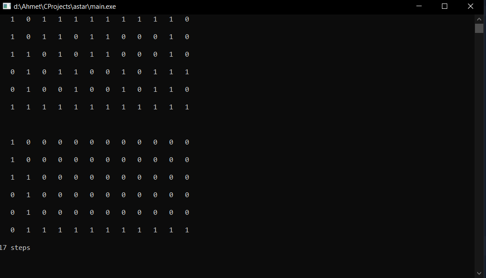
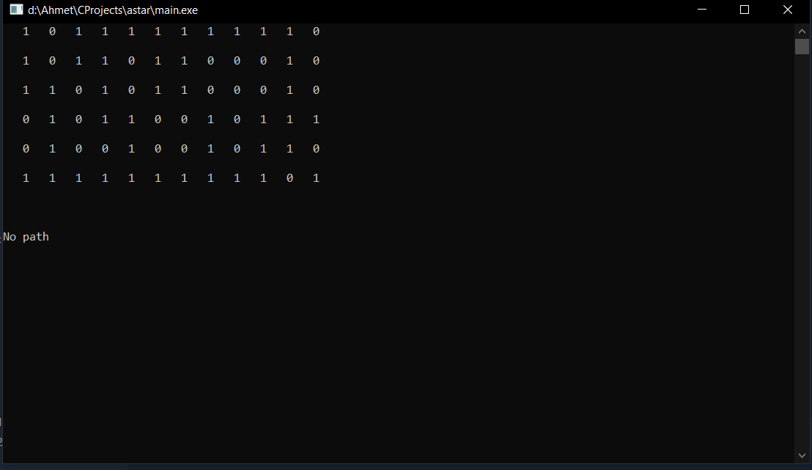

# Shortest Path Finder

I wanted to use a star algorithm with recursive function but it evaluated to different algorithm. It has similar points with a star like f cost but it is not an actual a star algorithm that I wanted.

If there is any path the output like this.

If there is no path the output like this. 
